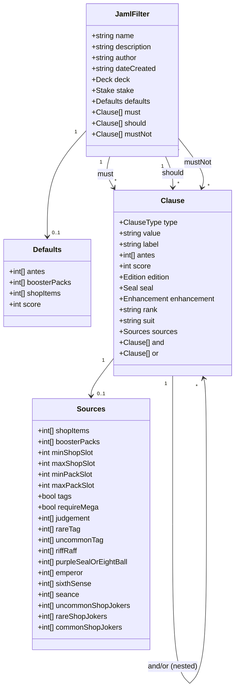
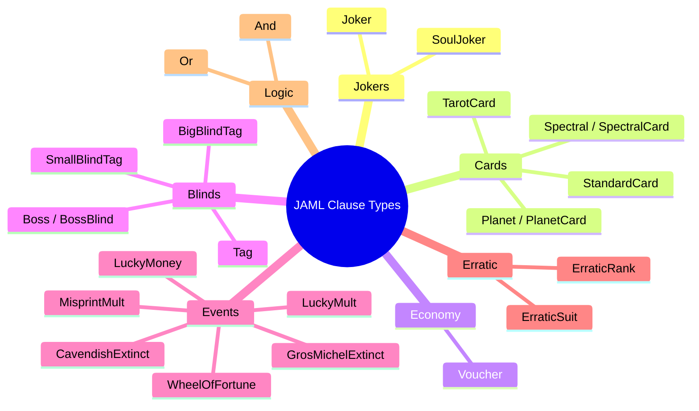
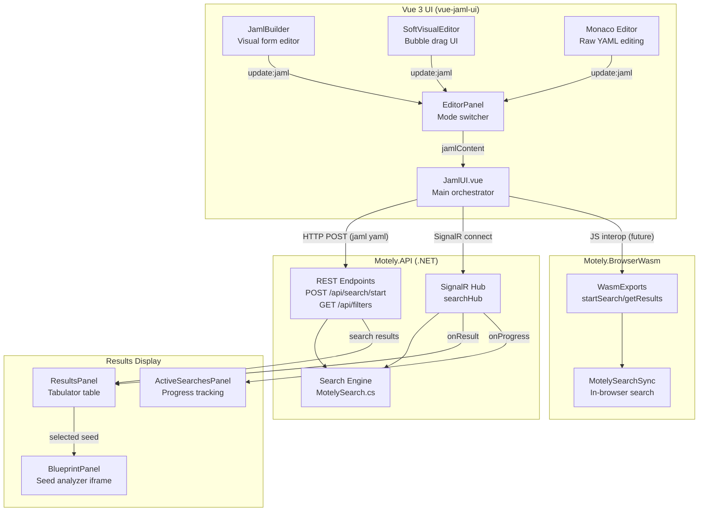
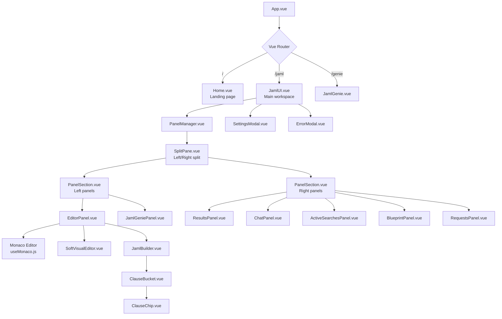
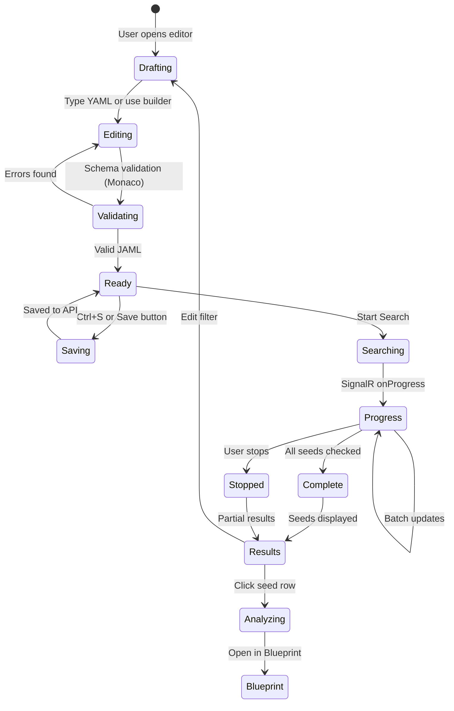
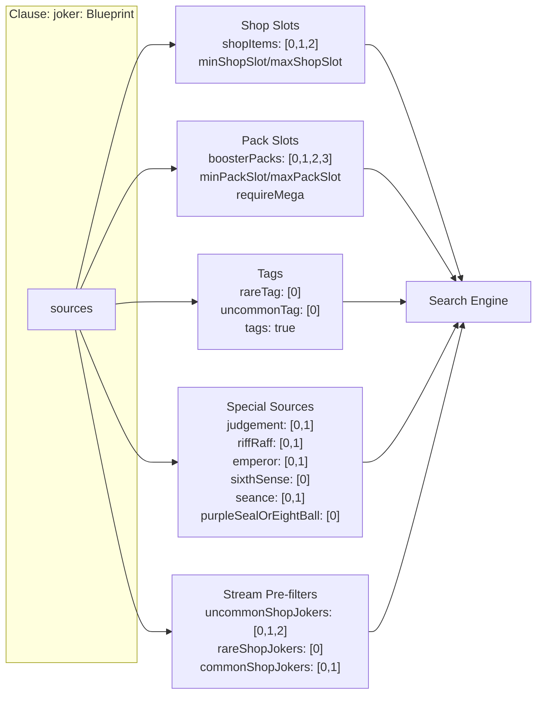
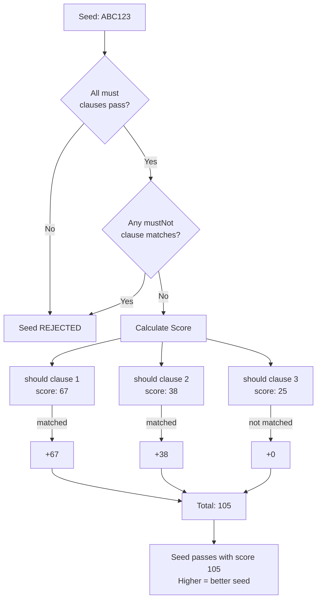
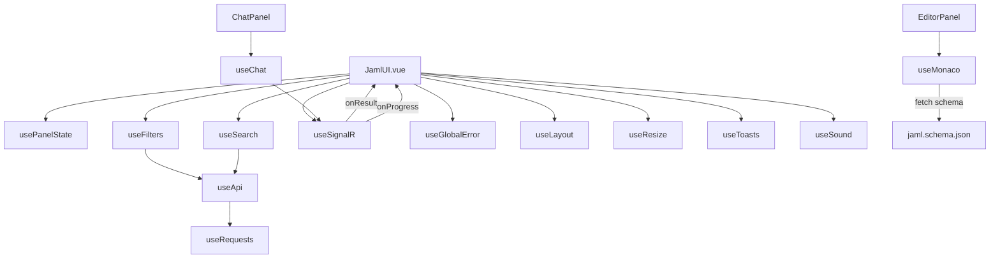
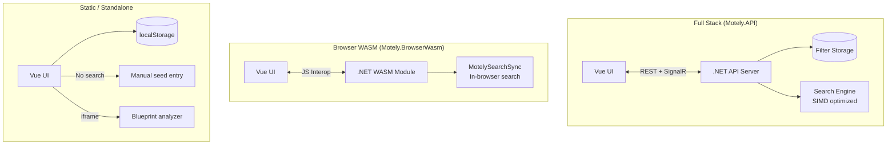
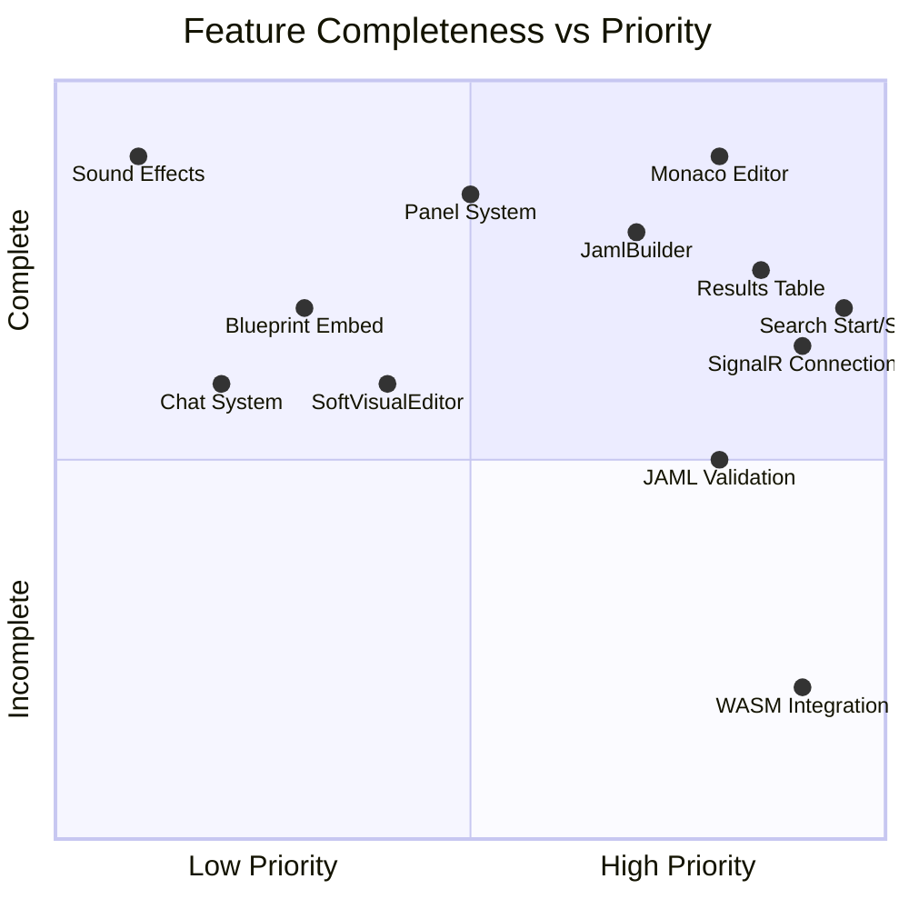

# JAML UI Architecture

## 1. JAML Schema Data Model

The core domain: what a `.jaml` filter file contains and how it flows through the system.

## 2. JAML Clause Type Taxonomy

Every item type JAML can search for, grouped by category.

## 3. End-to-End Data Flow

How JAML goes from the user's brain to search results on screen.

## 4. UI Component Hierarchy

The actual Vue component tree and how panels compose.

## 5. JAML Filter Lifecycle

A filter goes through these states from creation to search results.

## 6. JAML Source Resolution

How the `sources` object in a clause determines where to look for items.

## 7. Must / Should / MustNot Scoring Logic

How the three clause buckets combine to score a seed.

## 8. Composable Dependency Graph

How the Vue composables wire together.

## 9. Integration Points: API vs WASM vs Standalone

Three deployment modes and what each supports.

## 10. What's Working vs What Needs Work

Current state assessment.

### Known Bugs to Fix

| File | Issue | Severity |
|------|-------|----------|
| `useApi.js` | `updateRequest(0, ...)` hardcodes index 0 instead of using `requestIndex` | Medium |
| `usePanelState.ts` | `isBasePanel` always returns false (ID format mismatch) | Medium |
| `useSignalR.js` | Hardcoded dev IP `192.168.0.171:3141` | High |
| `useSignalR.js` | `disconnect()` is a no-op | Low |
| `useRequests.js` | `updateRequest(index)` receives wrong type from `addRequest` | Low |

### Missing for Standalone JAML UI

1. **WASM bridge**: `Motely.BrowserWasm` exists but isn't wired to the Vue UI yet
2. **Offline filter storage**: Currently requires API; needs localStorage fallback
3. **Schema validation in builder**: JamlBuilder doesn't validate against schema in real-time
4. **Export/share**: No way to share a `.jaml` file URL or download
