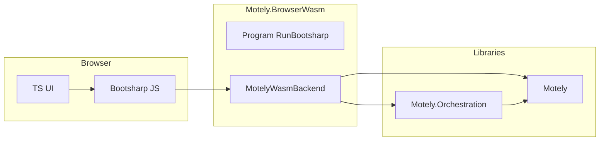

# Plan: WASM host = Bootsharp glue + Motely.Orchestration brain

## Is Bootsharp “making it for us”?

**Partially.**

| Bootsharp *does* generate | Bootsharp *does not* do |
|---------------------------|-------------------------|
| JS/TS interop wiring from your exported C# surface (`JSExport` / `JSImport` assembly attributes, preferences) | Decide what your WASM API *means* or which operations exist |
| Boot sequence, dispatch, TS types for exported shapes | Implement search, JAML validation, shop streams, or JSON contracts |
| Packaging/publish layout for the browser runtime | Replace `MotelySearchOrchestrator`, `MotelyShopItemProvider`, analyzers |

So: **Bootsharp removes hand-written JS↔C# glue**; it does **not** replace **domain logic**. That logic should live in **`Motely`** + **`Motely.Orchestration`** (and analysis types), same as CLI/TUI/API.

## Why build the WASM backend from Motely.Orchestration?

**Because that’s the single “brain” you already trust.**

- **`MotelySearchOrchestrator`**, **`MotelyShopItemProvider`**, and related types are the same paths **Node** (when you had it), **CLI**, **workers**, and **tests** should use.
- The **BrowserWasm host** should be a **thin façade**: `IMotelyWasmBackend` methods deserialize args, call orchestration/analyzer APIs, serialize DTOs/JSON strings for JS.
- **Do not** reimplement search or shop math inside the host “because WASM is special.” Special = threading/cancellation/JSON only.

## Implementation outline (replaces scattered “Claude vs Composer” checklists)

1. **Restore `Motely.BrowserWasm`** from before `c7689f35`: `Program.cs`, `Interop/IMotelyWasmBackend.cs`, `MotelyWasmBackend.cs`, `MotelyWasmInteropTypes.cs`, `IMotelyJsUi.cs`, `ConsoleForwarder.cs`, `Motely.BrowserWasm.csproj`.
2. **Project references:** `Motely` **and** `Motely.Orchestration` (backend must call orchestrator; Orchestration already references Motely).
3. **Review `MotelyWasmBackend`:** every public WASM operation should **delegate** to existing orchestration/analyzer APIs; extend orchestration if the WASM surface needs a new capability (don’t fork logic in the host).
4. **LLVM / publish:** optional `BootsharpLLVM` toggle + ILCompiler.LLVM packages + experimental feed (see [WASM-LLVM-and-node-publish-plan.md](./WASM-LLVM-and-node-publish-plan.md)); publish **only** the host: `dotnet publish Motely.BrowserWasm -c Release -f net10.0-browser -r browser-wasm`.
5. **Library cleanup:** `Motely` stays **`OutputType>Library</OutputType>`** for any retained `net10.0-browser` compile slice, or drop browser TFM from `Motely` once the host is the only browser consumer (Option A in prior doc).
6. **Staging:** `stage-wasm.mjs` / `build-and-pack.ps1` point at **`Motely.BrowserWasm`** publish output (verify actual `bootsharp/` path after first green publish).

## Relation to older docs

- **[WASM-LLVM-and-node-publish-plan.md](./WASM-LLVM-and-node-publish-plan.md)** — LLVM feeds, ILCompiler versions, Node managed vs native, TestUI validation.
- **This file** — answers “who builds what”: **Bootsharp = interop**, **Orchestration = behavior**.
